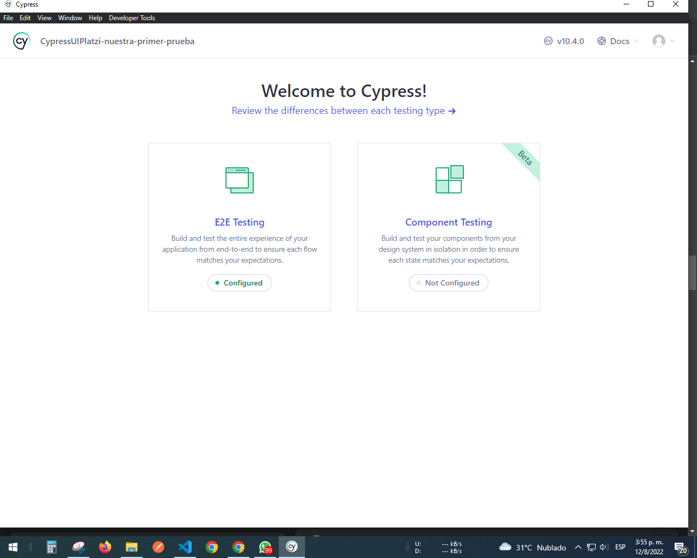
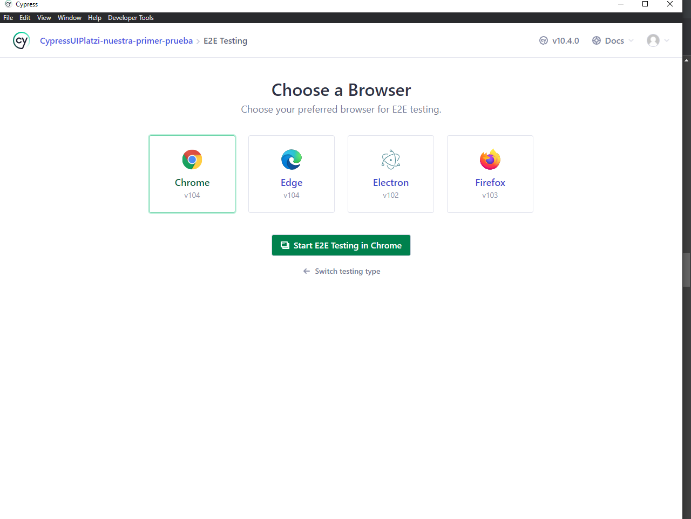
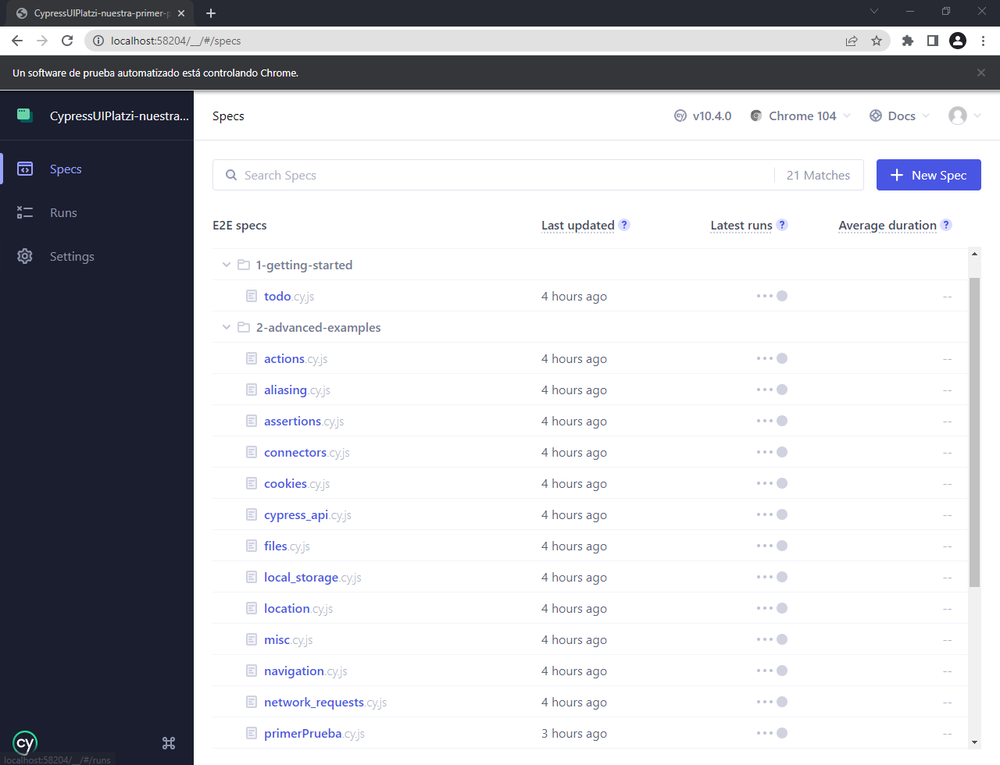
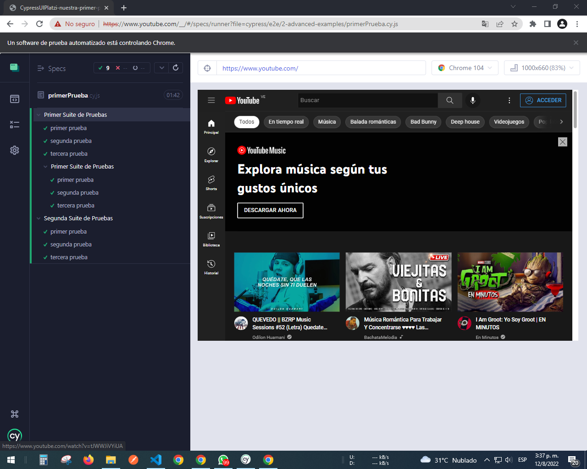

# UI-Test-Automation-with-CYPRESS

## A little test with CYPRESS
In order to download the file and install it in our local environment we have to do a series of steps.
* 1) We download the project

* 2) We open the project in the editor of your choice

* 3) We open the terminal and install some dependencies so that the project can be executed:

> * npm i -D cypress prettier
After having installed this dependency, we place the following command
> * npm run test
this command will open a Cypress window

###### After having placed that command, a page similar to this will open

###### Once this image is open, we click on the button where it says E2E TESTING.
That will send us to this tab

###### Here we are going to choose the browser of your choice
After this step we will look for the name that we added to the project in this case the name is "PrimerTrueba.cy"

###### In this image the file appears last
Once you have already selected the project, CYPRESS will start executing it and it should give us a result like this

